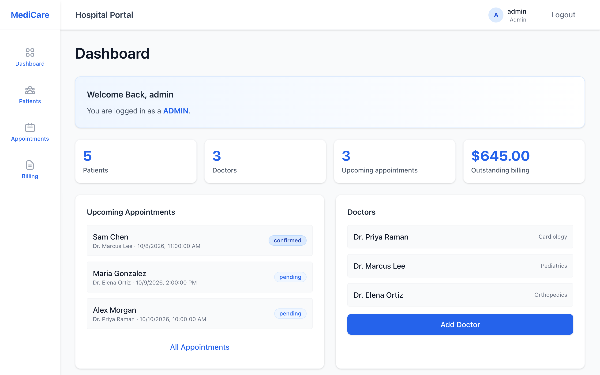
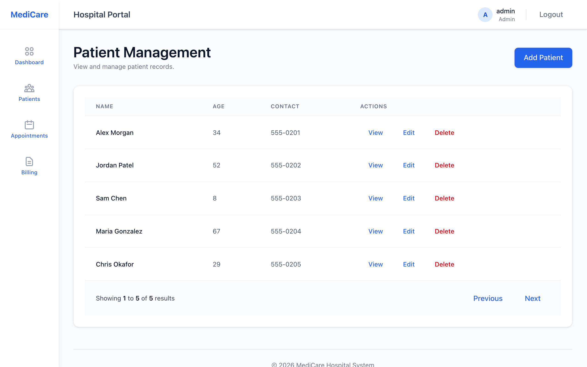
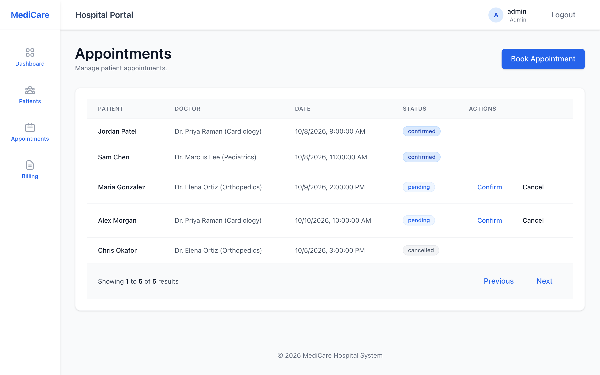
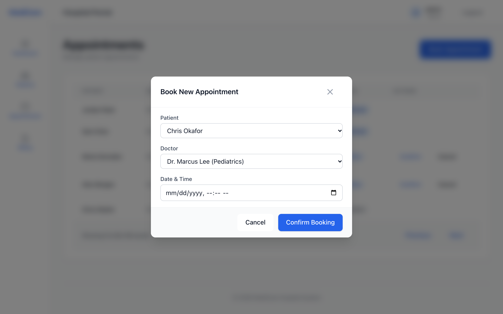
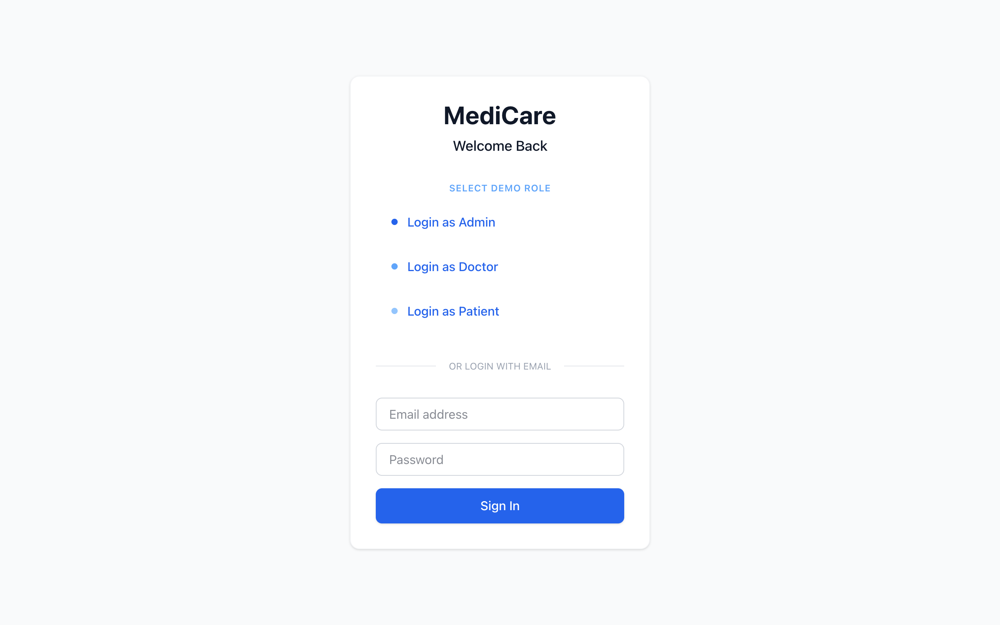
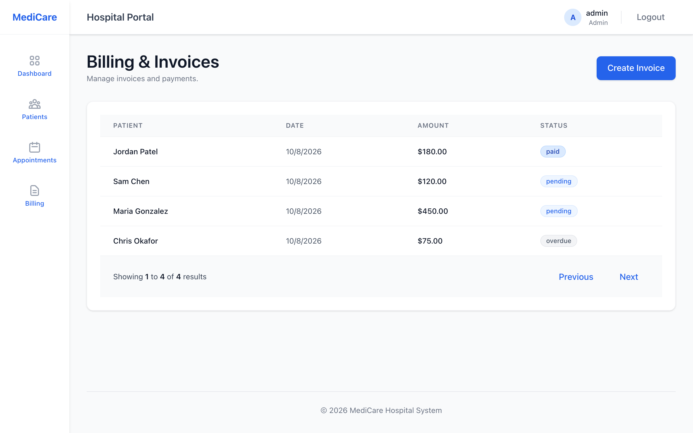

# Hospital Management System

A full-stack MERN app for running a small clinic's front desk: patients, doctors, appointments and billing behind JWT login.



It's a CRUD app, built to practice an end-to-end TypeScript stack: React + Vite on the front, Express + Mongoose on the back, with API tests that run against a throwaway in-memory MongoDB.

## Highlights

- **JWT auth that fails closed.** All patient, doctor, appointment and billing routes require a Bearer token. The server refuses to start without `JWT_SECRET` (there is no default secret), and self-registration always creates a `patient` account, whatever role the client sends.
- **Real doctor model.** You book appointments against `Doctor` records, and the list shows each doctor's name and specialization from the database.
- **Dashboard from live data.** Patient and doctor counts, upcoming appointments and outstanding billing are all calculated from the API.
- **Zero-setup dev mode.** `npm run dev:memory` starts the API on an in-memory MongoDB with demo users and sample records, so you don't need a local Mongo install.
- **Tested API.** 15 supertest tests (Vitest + mongodb-memory-server) cover register/login, token rejection, patient CRUD, booking appointments and invoices. They run in GitHub Actions along with a server type-check and a client build.

| Patients | Appointments | Book an appointment |
| --- | --- | --- |
|  |  |  |

| Login | Billing |
| --- | --- |
|  |  |

## Tech stack

- **Client:** React 19, TypeScript, Vite, Tailwind CSS 4, React Router, Axios
- **Server:** Node.js, Express 5, Mongoose 9, JSON Web Tokens, bcryptjs
- **Tests:** Vitest, supertest, mongodb-memory-server

## Getting started

Prerequisites: Node.js 20 or newer. MongoDB is optional, because the in-memory mode below needs nothing else.

```bash
git clone https://github.com/sandeepvijayarao09/Hospital-Management-System-Updated.git
cd Hospital-Management-System-Updated
```

### 1. Server

```bash
cd server
npm install
cp .env.example .env      # then set JWT_SECRET to a long random string
npm run dev:memory        # in-memory MongoDB + demo data, on http://localhost:5001
```

To use a real database, set `MONGO_URI` in `server/.env` and run `npm run dev`. If that database can't be reached in development, the server falls back to an in-memory one. With `NODE_ENV=production` it exits instead.

| Variable | Required | Purpose |
| --- | --- | --- |
| `JWT_SECRET` | yes | Signs login tokens. The server won't start without it. |
| `MONGO_URI` | no | MongoDB connection string (default `mongodb://localhost:27017/hospital-management`) |
| `PORT` | no | API port (default `5001`, which the Vite proxy expects) |
| `USE_MEMORY_DB` | no | `true` to use an in-memory MongoDB |
| `SEED_DEMO` | no | `true` to load sample doctors, patients, appointments and invoices |

### 2. Client

In a second terminal:

```bash
cd client
npm install
npm run dev               # http://localhost:5173, proxies /api to :5001
```

### 3. Log in

Outside production, the server seeds three demo accounts. The "Login as ..." buttons on the login page use them:

| Role | Email | Password |
| --- | --- | --- |
| Admin | `admin@hospital.com` | `admin` |
| Doctor | `doctor@hospital.com` | `doctor` |
| Patient | `patient@hospital.com` | `patient` |

These are demo accounts for local use only. They are never created when `NODE_ENV=production`.

## Tests

```bash
cd server
npm test            # Vitest + supertest against an in-memory MongoDB
npm run typecheck   # tsc --noEmit
```

The first run downloads a MongoDB binary for mongodb-memory-server, so it takes longer.

## API

All routes except `/api/auth/*` need an `Authorization: Bearer <token>` header.

| Resource | Endpoints |
| --- | --- |
| Auth | `POST /api/auth/register`, `POST /api/auth/login` |
| Patients | `GET/POST /api/patients`, `GET/PUT/DELETE /api/patients/:id` |
| Doctors | `GET/POST /api/doctors`, `GET/PUT/DELETE /api/doctors/:id` |
| Appointments | `GET/POST /api/appointments`, `PUT /api/appointments/:id/status` |
| Billing | `GET/POST /api/billing`, `PUT /api/billing/:id` |

## Scope and limitations

- Authentication is in place, but there is no role-based authorization yet. Any logged-in user can read and change every record. The role currently changes only which sidebar links appear.
- Appointments and invoices aren't linked to the logged-in patient or doctor account.
- The table footer shows a result count, but pagination isn't implemented.

## License

[MIT](LICENSE)
